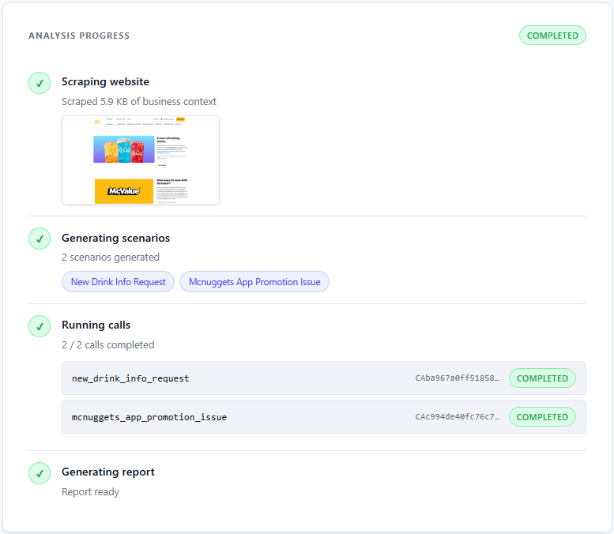
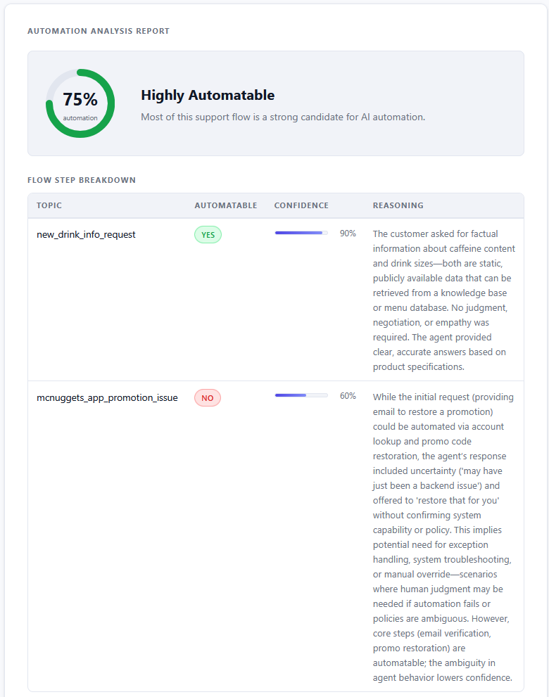
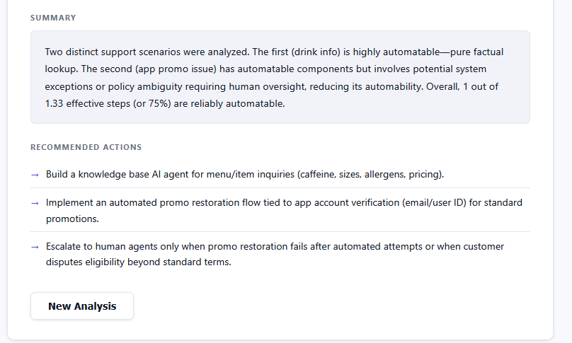

# Gunk

**AI-powered voice agent analysis for customer support operations.**

Gunk calls a business's phone number, simulates realistic customer interactions across multiple scenarios, and produces a structured report identifying which parts of their support flow can be automated by an AI voice agent — and which require a human.

Built from scratch on May 30, 2026.

---

## How it works

1. Submit a business website URL and phone number
2. Gunk scrapes the website (Firecrawl) to understand the business context
3. An LLM generates tailored call scenarios specific to that business type
4. Gunk calls the number sequentially with each scenario, acting as a realistic customer
5. All calls are analyzed and a structured automation report is produced

---

## Tech stack

- **Pipecat** — voice agent orchestration; manages the real-time pipeline of STT → LLM → TTS over a Twilio WebSocket stream
- **NVIDIA Nemotron** (hosted on AWS via vLLM) — LLM for both the customer agent and post-call report analysis; accessed via OpenAI-compatible structured output API
- **Gradium** — speech-to-text and text-to-speech
- **Twilio** — outbound phone calling and audio streaming
- **Cekura** — call observability; session transcripts and audio are automatically uploaded after each call. During development, our coding agents used Cekura's MCP server to pull logs and analyze what went wrong in real time
- **Firecrawl** — business website scraping to generate context-aware call scenarios
- **FastAPI** — backend server

---

## Feedback on tools

**NVIDIA Nemotron** — inference latency was a little slow for a real-time voice use case (~2–3s TTFB for the first response), though subsequent turns were faster. Works well for offline analysis tasks like report generation.

**Twilio** — worked great for outbound calling and audio streaming. The main challenge was verification: it was hard for our coding agents to have a tight feedback loop since every test required a real phone call, making iteration slower than a local browser-based test.

---

## Screenshots







---

## Running locally

See [SETUP.md](SETUP.md) for full setup instructions. You'll need a `.env` file
with the required API keys (Twilio, Firecrawl, Nemotron, Cekura) before running.

```bash
# Install dependencies
uv sync

# Start the server
cd server
PYTHONUTF8=1 uv run uvicorn main:app --host 0.0.0.0 --port 8000

# Open the UI in your browser
# http://localhost:8000
```
